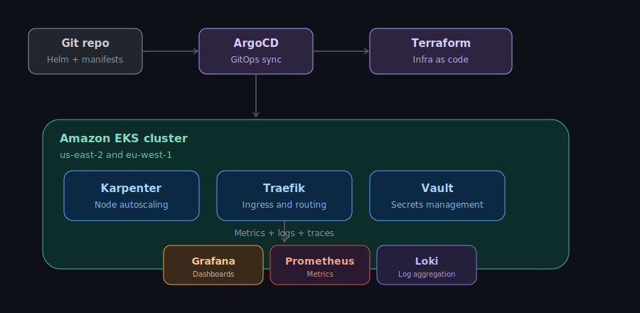

  
  
  

I run production EKS clusters that need to stay up. That means real incidents, real root causes, and real fixes — not just YAML tutorials.

I'm currently open to **remote DevOps roles**.

 

## What I actually do

- **Kubernetes at scale** — manage EKS clusters across regions, autoscaled with Karpenter.
- **GitOps** — ArgoCD-driven deployments, including live major-version upgrades with zero downtime.
- **Ingress & security** — Traefik Gateway Api and Nginx-Ingress routing, RBAC design, and incident response when it breaks in production.
- **Secrets & config** — Vault, Helm, Terraform for infrastructure as code.
- **CI/CD** — Jenkins pipelines shipping to AWS ECR.
- **Observability** — Grafana dashboards, Prometheus metrics, and Loki log aggregation across production clusters.

 

## How the pieces fit together

This is the shape of most of my production work: code lands in Git, ArgoCD syncs it into the cluster, Karpenter keeps nodes sized to load, Traefik routes traffic in, Vault keeps secrets out of manifests, and Grafana, Prometheus, and Loki watch all of it.

 

## A few things I've shipped

- 🔥 **Diagnosed a full production outage** caused by a Traefik RBAC gap that blocked all public services — traced it to a ClusterRoleBinding mismatch introduced by a Helm upgrade, and fixed the single point of failure it exposed.
- ⬆️ **Upgraded ArgoCD across a major version bump** while protecting existing NetworkPolicies from being silently overwritten by `selfHeal` and `prune`.
- 📦 **Migrated Karpenter through two major versions** (1.8 → 1.11), safely transferring CRD ownership without losing running nodes.
- 🖥️ **Designed a remote cloud dev environment** (Coder + ArgoCD ApplicationSet + EFS) to remove the need for developers to clone a multi-GB monorepo onto their laptops.
- 🐕 **Deployed Falco to production via ArgoCD** and diagnosed a pod-scheduling deadlock caused by an overly broad `podAntiAffinity` rule.
- 🗃️ **Migrated SonarQube's database** from embedded Bitnami PostgreSQL to an external instance — full pg_dump/restore with zero data loss across a mandatory intermediate-version upgrade path.

I write these up as I go — not polished war stories, just what actually happened and what I'd do differently next time.

 

## Currently exploring

- Remote-first DevOps and Platform Engineering roles.
- Deeper observability work — custom Grafana dashboards, PromQL, and log-based alerting on Kubernetes.
- Developer-experience tooling that makes Kubernetes less painful for the people who aren't infra specialists.

 

## Contact

 

## Tech stack

 

 

 

## GitHub stats

  
  

  

  

